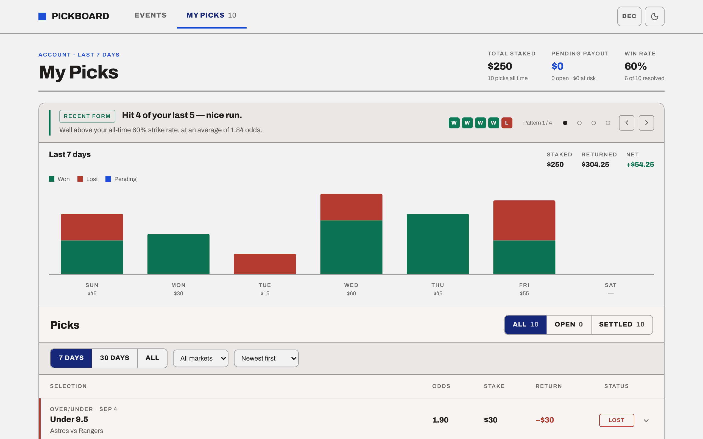
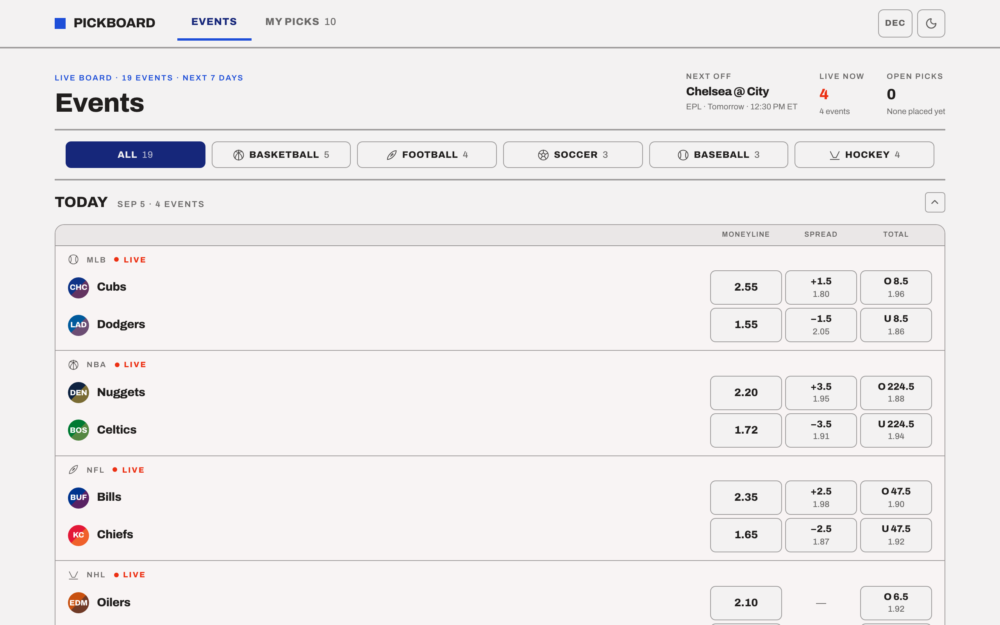
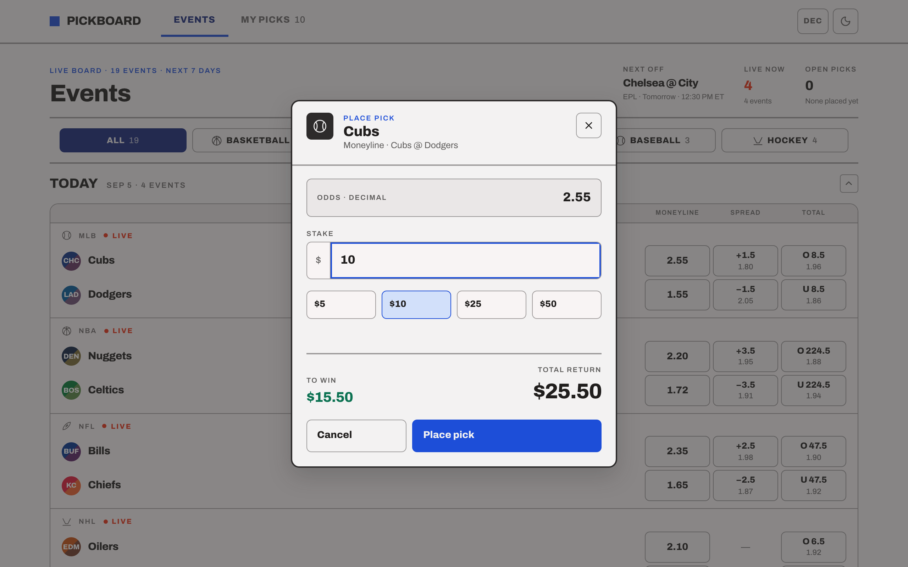
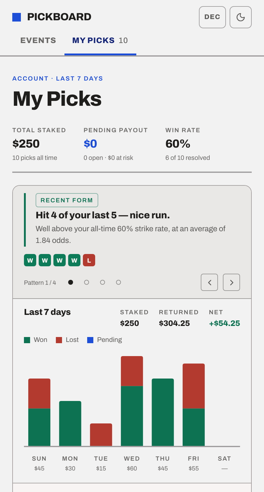

<div align="center">

# PickBoard

**A mini sportsbook: browse an odds board, place single-leg picks, and read your record back
on a dashboard that tells you something you did not already know.**

[](https://github.com/uladzislau-ivanou/pick-board/actions/workflows/ci.yml)
[](https://github.com/uladzislau-ivanou/pick-board/actions/workflows/deploy.yml)


### [→ Live demo](https://uladzislau-ivanou.github.io/pick-board/)

</div>



## What it does

Two screens, sharing one picks context.

- **Events** — 20 mock fixtures across 5 sports over the next 7 days, laid out the way a
  sportsbook lays one out: teams stacked left, three fixed price columns (Moneyline / Spread /
  Total) headed once per day group. Filter by sport, page days on demand.
- **Place Pick** — tap any price to open a modal pre-filled with that selection. Type a stake
  and the payout recomputes live. Confirm and the pick lands on My Picks as **Pending**.
- **My Picks** — all-time totals, a ranked insight strip reading your recent pattern, a
  clickable 7/30/all-day chart of daily stake by outcome, and a filterable ledger of every pick.

Prices render in **decimal or American** odds, the theme follows your system preference with a
manual override, and placed picks survive a reload.

**Tech:** React 19 · TypeScript (`strict`) · Vite 8 · Tailwind CSS v4 · React Router · Recharts ·
Vitest + Testing Library · ESLint with enforced architecture boundaries.

## Quick start

**Prerequisites:** Node **24.2+** (`.nvmrc` is set — `nvm use` picks it up).

```bash
git clone https://github.com/uladzislau-ivanou/pick-board.git
cd pick-board
npm ci        # the lockfile is committed — this is what CI installs
npm run dev   # → http://localhost:5173
```

| Script                            | What it does                                 |
| --------------------------------- | -------------------------------------------- |
| `npm run dev`                     | Dev server                                   |
| `npm run build`                   | `tsc -b`, then a production build            |
| `npm run preview`                 | Serve the production build locally           |
| `npm run typecheck`               | `tsc -b` under `strict`                      |
| `npm run lint`                    | ESLint — **includes the FSD boundary rules** |
| `npm test`                        | Vitest, single run                           |
| `npm run test:watch`              | Vitest, watch mode                           |
| `npm run format` / `format:check` | Prettier                                     |

CI runs typecheck → lint → format → test → build on every push and pull request.

## Screens

|                                                Events                                                |                                     Place Pick                                      |
| :--------------------------------------------------------------------------------------------------: | :---------------------------------------------------------------------------------: |
|                                                                      |                                             |
| Three fixed price columns, headed once per day group, with an em-dash where a market is not offered. | The selection, its market and event, the odds, a validated stake and a live payout. |

<div align="center">
  
  <p><em>The same dashboard at 430px — the ledger becomes labelled cards, driven by a container query rather than a viewport breakpoint.</em></p>
</div>

## Where each requirement lives

| Requirement                                     | Where                                                                        |
| ----------------------------------------------- | ---------------------------------------------------------------------------- |
| Events screen · 2–3 markets each · decimal odds | `src/pages/events/` · fixtures in `src/entities/event/api/event-fixtures.ts` |
| Place Pick modal · stake input · live payout    | `src/features/place-pick/ui/PlacePickModal.tsx`                              |
| My Picks dashboard · placed + seeded history    | `src/pages/my-picks/` · `src/widgets/pick-ledger/`                           |
| Pick insight logic                              | `src/features/pick-insights/model/get-pick-insights.ts` · `model/rules.ts`   |
| Chart over the last 7 days                      | `src/features/daily-performance/`                                            |
| Context API for the picks list                  | `src/entities/pick/model/PicksProvider.tsx`                                  |
| `Market`, `Outcome`, `Pick` interfaces          | `src/entities/event/model/types.ts` · `src/entities/pick/model/types.ts`     |
| **`calculatePayout`** + tests                   | `src/entities/pick/lib/calculate-payout.ts` · `.test.ts`                     |
| **`getPickInsight`** + tests                    | `src/features/pick-insights/model/get-pick-insights.ts` · `.test.ts`         |

Two names differ from the brief, on purpose:

- **`Event` is `SportEvent`.** `Event` is a DOM global; shadowing it in an app full of event
  handlers is a trap.
- **`getPickInsight` is `getPickInsights`.** The engine returns _every_ pattern that fires,
  ranked, and the card is a carousel over them — one message is a fortune cookie, a ranked set is
  a read. The brief's singular `getPickInsight` is exported beside it and returns the top one.

The brief's "Total Potential Payout" is labelled **Pending payout** on screen: same figure,
scoped to pending picks only.

## Architecture

[Feature-Sliced Design](https://feature-sliced.design). Imports go **down only** — never
sideways, never up:

```
app  →  pages  →  widgets  →  features  →  entities  →  shared

src/
  app/        composition root, router, global styles, the end-to-end test
  pages/      events, my-picks
  widgets/    app-header, event-board, pick-ledger
  features/   place-pick, filter-picks, pick-insights, daily-performance
  entities/   event, pick
  shared/     config, lib, ui, styles
```

`eslint-plugin-boundaries` makes this a build gate rather than a naming convention. A layer may
import lower layers **only through the target slice's `index.ts`**, so a deep import fails
`npm run lint`; `recharts` is confined to `features/daily-performance`; and `entities`/`shared`
may not import the router. Cross-slice imports use `@/`, intra-slice imports are relative, so
every boundary crossing is greppable.

**State ownership** — the rule that decides each case: _if changing A must atomically reset B,
A and B live in one reducer._

| State                                                         | Owner                                                                                                      |
| ------------------------------------------------------------- | ---------------------------------------------------------------------------------------------------------- |
| `picks`                                                       | `entities/pick/model` — React Context, shared by both screens                                              |
| Modal `draft` + `stake`                                       | `features/place-pick/model` — local; a second context would add indirection without removing a prop        |
| `tab`, `period`, `market`, `sort`, `dayFilter`, `visibleRows` | `features/filter-picks/model` — one reducer, which is why the chart and the ledger can never disagree      |
| `sport` + open days + visible days                            | `widgets/event-board/model` — picking a sport filters, expands and resets the day window in one transition |
| `oddsFormat`, `theme`                                         | `shared/lib` — display preferences every screen reads                                                      |

Files: components `PascalCase.tsx`, everything else `kebab-case.ts`. Tests sit beside their
source.

## The insight heuristic

`getPickInsights(picks, now)` returns every pattern that fires, positives before warnings.
Pending picks are excluded — a pick that has not settled is not evidence. Under three resolved
picks it returns a single neutral card; if nothing fires, it falls back to a neutral "steady
form" reading.

| #   | Tone | Fires when                                           | Scope       |
| --- | ---- | ---------------------------------------------------- | ----------- |
| 1   | good | ≥3 consecutive wins at the newest end                | —           |
| 2   | good | ≥4 wins in the last 5 resolved                       | —           |
| 3   | good | Best market with 3+ resolved picks at ≥60%           | that market |
| 4   | good | Positive net return over the last 7 days, ≥3 settled | —           |
| 5   | bad  | ≥3 consecutive losses within one market type         | that market |
| 6   | bad  | ≤1 win in the last 5 resolved                        | —           |
| 7   | bad  | Worst market with 3+ resolved picks at ≤34%          | that market |
| 8   | bad  | Negative net return over the last 7 days, ≥3 settled | —           |
| 9   | bad  | Last-3 average stake > 1.5× the all-time average     | —           |

Rules 3 and 7 each report at most one market, the one at the extreme; rule 5 reports every cold
market. Rules 5 and 7 can describe the same market, so rule 7 skips any market rule 5 already
covers — both read the `coldMarkets` list that `buildContext` computes once, so no rule depends
on another.

`now` is a parameter rather than a `Date.now()` call inside the function, which is the only
reason the week-to-date rules are testable at all. The same is true of `groupByDay(events, now)`,
`periodRange(period, picks, now)` and `dailyBuckets(picks, range)`.

## Testing

```bash
npm test
```

**316 tests in 40 files**, all colocated with their source and all deterministic, because `now`
is injected everywhere it matters. The whole suite runs in under five seconds.

- The brief's two required targets: **`calculatePayout`** and the **insight engine, per rule**.
- Plus `groupByDay`, every `entities/pick/lib/stats` function, `periodRange`/`periodLabel`,
  `dailyBuckets`, `applyPickQuery`, the pick-query reducer and the shared formatters.
- Component tests for the board, modal, chart, ledger and dashboard.
- **Integration** — `src/app/App.integration.test.tsx` renders the real `<App />` and walks the
  definition of done: tap a price → type a stake → place the pick → it is top of My Picks as
  Pending, Total Staked and Pending Payout have moved, Win Rate has not, and a reload keeps it.
- **Accessibility** — `App.a11y.test.tsx` runs axe over both screens and the open modal, so the
  claims below are enforced rather than asserted. It caught a real heading-order break.
- **Property-based** — `calculate-payout.property.test.ts` checks the invariants over generated
  money: never more than two decimals, never less than the stake, monotonic in stake, and
  payout = profit + stake.

> **If a test surprises you:** Recharts' `ResponsiveContainer` measures 0 in jsdom, so the bars do
> not render under test. That is deliberate — every assertion targets the HTML rows and the
> overlay buttons, which is also where all the behaviour lives.

Layout, contrast, focus rings and tap targets were verified by driving a real browser at
320–1280px, not read off the CSS.

## Accessibility

- The modal is `role="dialog" aria-modal="true"`, labelled by the selection, focus moved to the
  stake input, focus **trapped**, Escape closes, focus **returned** to the price that opened it.
- Day headers and ledger rows are `<button aria-expanded aria-controls>`. The stake input has a
  real `<label>`, `inputmode="decimal"` and an `aria-live` validation line.
- **Chart columns are real `<button>`s over the bars**, each carrying the figures in its
  `aria-label` — an SVG `<rect>` cannot hold an accessible name, so those figures would otherwise
  be mouse-only.
- Never colour alone: Won / Lost / Pending each carry a text label as well as a fill.
- Muted text is held above the 4.5:1 AA floor, and the `:focus-visible` ring is drawn _inside_ the
  element — an outline paints outside the border box, so on any control flush inside an
  `overflow-hidden` parent an outset ring is silently clipped away.
- Light and dark flip token _values_ only: there is not one `dark:` variant in the app, and an
  inline script in `index.html` resolves the theme before first paint, so there is no flash.

## Decisions and assumptions

| Decision                                                | Reasoning                                                                                                                                                                                                                     |
| ------------------------------------------------------- | ----------------------------------------------------------------------------------------------------------------------------------------------------------------------------------------------------------------------------- |
| **No settlement**                                       | Placed picks stay Pending; all Won/Lost data is seeded. Settling on a timer would fake a backend and make every test time-dependent.                                                                                          |
| **Summary totals are always all-time**                  | The period control scopes the chart and the ledger, deliberately not the three totals — a "total staked" that shrinks when you change a filter is not a total. Each sub-line names the population it counted.                 |
| **Decimal and American odds, no fractional**            | `payout = stake × odds` always; the format is a display concern behind one context. Fractional adds a third rounding table for no reader this app has.                                                                        |
| **The board is a fixed three-column grid**              | Moneyline / Spread / Total in that order on every card, headed once per day group, empty where a market is not offered. Sizing columns per card is what makes an odds board unscannable — the column you are comparing moves. |
| **Seeded picks reference events absent from the feed**  | The two fixture sets are independent on purpose: `Pick` carries a display string, not an `eventId`.                                                                                                                           |
| **Seeded history is not persisted**                     | It is regenerated from `Date.now()` on each load, so the dashboard never shows a stale week. Only picks _you_ place go to `localStorage`.                                                                                     |
| **The ledger pages, never infinite-scrolls**            | An explicit "Load 4 more" with a "6 of 10 shown" count. A record users audit needs a reachable bottom and a stable position.                                                                                                  |
| **Crests are two-tone monogram badges, not club logos** | Each club's real primary and secondary colour, so the demo ships without third-party marks. Swapping in `` is a one-file change in `TeamCell`.                                                                           |
| **No i18n**                                             | `en-US` dates and currency, pinned in `shared/lib/date` so tests stay stable.                                                                                                                                                 |

## Deployment

Pushing to `main` publishes `dist/` to GitHub Pages via
[`deploy.yml`](.github/workflows/deploy.yml).
